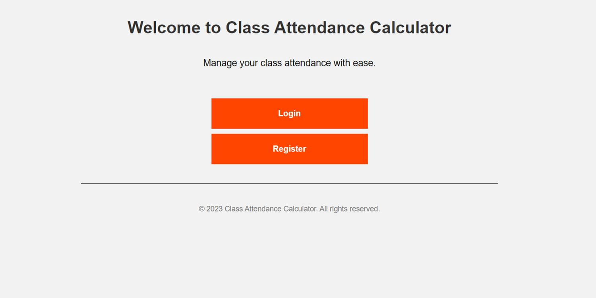
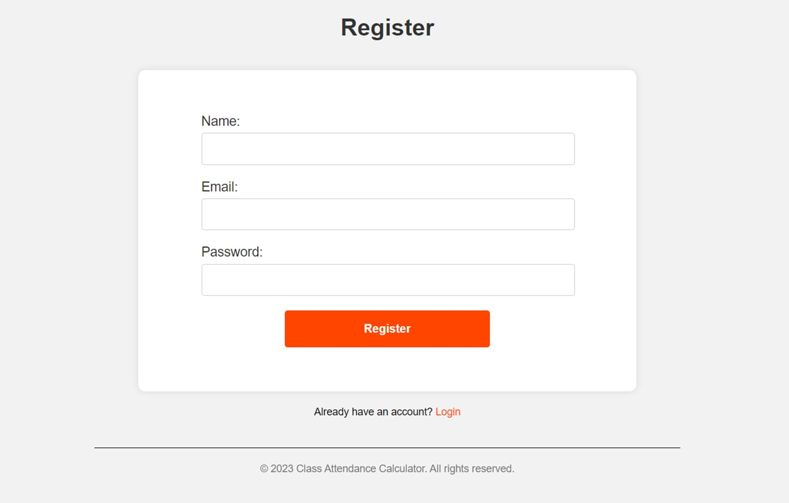
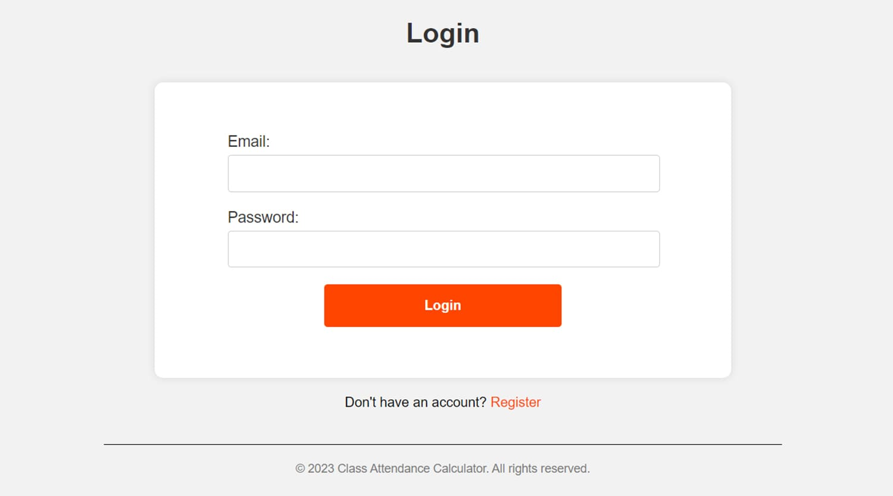
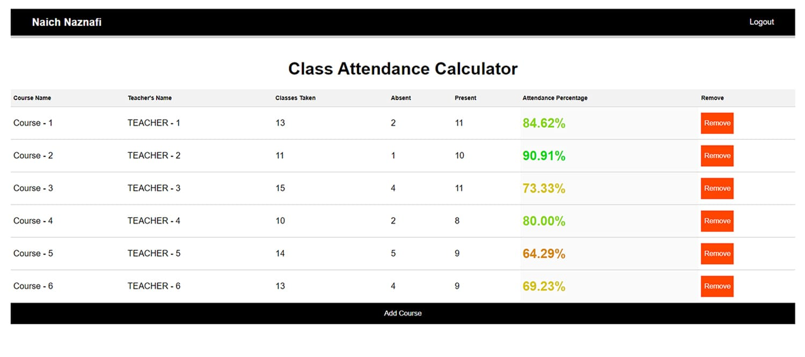
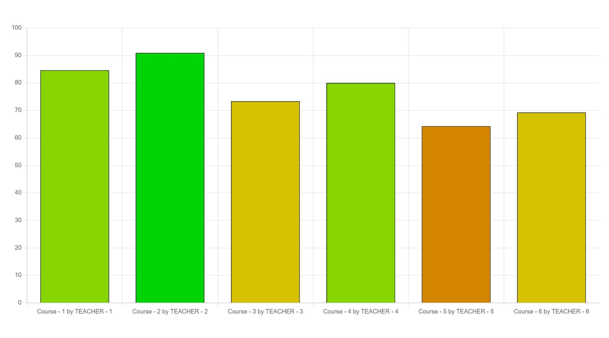
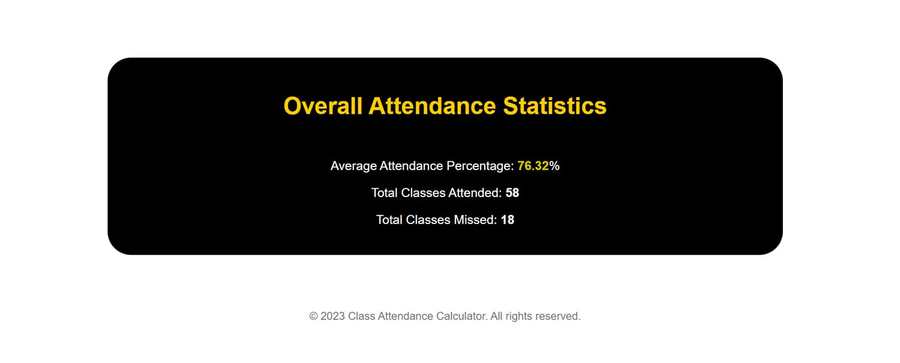
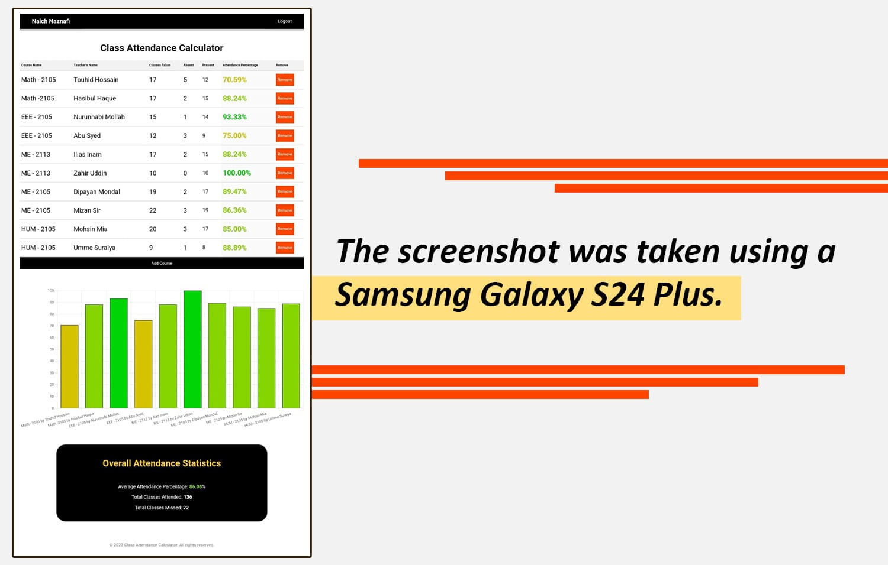

# Class Attendance Calculator

Welcome to the Class Attendance Calculator, a Flask-based web application designed to simplify attendance management for classes. This project provides a user-friendly interface for both students and instructors to track attendance efficiently.


*Home Page: This is the landing page of the application, welcoming users and providing an overview of its functionality.*

## Features

- **User Authentication**: Secure login and registration system.
- **Attendance Management**: Easily manage and track attendance for multiple classes.
- **Dashboard**: Visualize attendance statistics and trends through interactive charts.
- **Responsive Design**: Optimized for desktop and mobile devices.

## Accessing the Website

You can access the Class Attendance Calculator online for free at here: [Class Attendance Calculator](https://class-attendance-calculator.onrender.com).

## Screenshots

### Registration Page

*Registration Page: Allows new users to register with their name, email, and password. Error handling ensures valid inputs.*

### Login Page

*Login Page: Secure login form for registered users.*

### Dashboard (Desktop View)

*Dashboard: Provides an overview of attendance statistics for various classes in a tabular and graphical format.*

### Attendance Statistics Chart

*Attendance Chart: Visual representation of attendance statistics, helps users understand their progress at a glance.*

### Footer

*Footer: Footer content seamlessly integrated with attendance statistics enhances user experience.*

### Mobile View (After Login)

*Mobile View: Optimized interface for mobile devices, ensuring usability and responsiveness across different screen sizes.*

## Getting Started
***You can simply visit [HERE](https://class-attendance-calculator.onrender.com) to use this app.***
### Installation

1. Clone the repository:
   ```bash
   git clone https://github.com/Nafi7393/Class-Attendance-Calculator.git
   cd Class-Attendance-Calculator
   ```

2. Install dependencies:
   ```bash
   pip install -r requirements.txt
   ```

3. Set up environment variables for Flask (optional but recommended):
   ```bash
   export FLASK_APP=main.py
   export FLASK_ENV=development  # Set to 'production' for deployment
   ```

4. Run the application:
   ```bash
   flask run
   ```

5. Open your web browser and navigate to `http://localhost:5000` to view the application locally.

## Contributing

Contributions are welcome! Please fork the repository and create a pull request with your improvements.


## Acknowledgments

- Inspiration and initial structure from [Flask Documentation](https://flask.palletsprojects.com/)
- Chart visualization powered by [Chart.js](https://www.chartjs.org/)
- Responsive design techniques adapted from [Bootstrap](https://getbootstrap.com/)

---

© 2023 Class Attendance Calculator. All rights reserved.